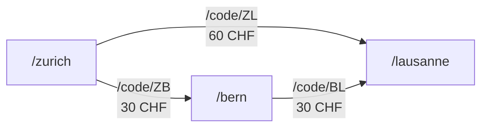

# Mangle

Mangle is a programming language for deductive database programming. It
is an extension of Datalog, with various extensions like aggregation, function
calls and optional type-checking.

Deductive database programming is useful for bringing data from multiple
data sources together since it enables us to represent and query that data in
a uniform way. It can also be used to model domain knowledge, similar
to machine-readable ontology but without being restricted to binary
predicates.

Datalog is an expressive declarative language similar to relational calculus
(think SQL and relational views). Unlike relational calculus, it also supports
recursive rules and program structuring in a straightforward way.

Mangle contains Datalog as a fragment and adds extensions that make its use
more practical. Some of the good properties like guaranteed termination are
lost when such extensions are used.

The goal of Mangle as an open source project is to convey the concepts in
a way that is accessible to developers and lends itself to easy experimentation.
This repository contains an implementation of Mangle as a go library that can be
easily embedded into applications.

Check out the [users documentation](https://mangle.readthedocs.io/en/latest/)
and the [Codeberg discussions](https://codeberg.org/TauCeti/mangle-go/discussions)
for more information. There is also a Q&A section.

For an example how to use Mangle library in a database-like grpc service,
see the separate [Mangle demo service repo](https://codeberg.org/TauCeti/mangle-service).

This repository is hosted on [Codeberg](https://codeberg.org/TauCeti/mangle-go) and mirrored to GitHub.

This is not an officially supported Google product.

## Projects Using Mangle

- [BrowserNerd](https://github.com/theRebelliousNerd/browserNerd) - token-efficient browser automation MCP server
- [CodeNerd](https://github.com/theRebelliousNerd/codenerd) - logic-first CLI coding agent system
- [Manglekit](https://github.com/duynguyendang/manglekit) - neuro-symbolic AI engine for Go

## Table of Contents
- [Projects Using Mangle](#projects-using-mangle)
- [Examples](#examples)
- [Building](#building)

## Examples

### Simple Queries

Imagine you were asked to spot software affected by the
[log4j vulnerability discovered in late 2021](https://www.cisa.gov/uscert/apache-log4j-vulnerability-guidance).
We want to look for projects that contain a Java archive (jar file) of
log4j that is not updated to the patched version.

```prolog
projects_with_vulnerable_log4j(P) :-
  projects(P),
  contains_jar(P, "log4j", Version),
  Version != "2.17.1",
  Version != "2.12.4",
  Version != "2.3.2".
```

This is a Mangle *rule*: conceptually, the implementation retrieve all
possible values for variables `P` and `Version` that make all the subgoals true.

Simple Mangle rules like this correspond to select-project-join relational
queries. The same query in SQL would look like this:

```sql
SELECT projects.id as P
FROM projects JOIN contains_jar ON projects.id = contains_jar.project_id
WHERE contains_jar.version NOT IN ("2.17.1", "2.12.4", "2.3.2")
```

Unlike SQL, our Mangle rule `projects_with_vulnerable_log4j` has a name
and can be referenced in other queries.

(If translating non-recursive Datalog into SQL queries sounds interesting, you
should check out the [Logica](https://logica.dev/) open source project.)

### Aggregation

In practice, querying is rarely enough and we also need grouping and
aggregation.

```
count_projects_with_vulnerable_log4j(Num) :-
  projects_with_vulnerable_log4j(P) |> do fn:group_by(), let Num = fn:Count().
```

### Recursive Queries

The example does not specify what `contains_jar` does. Here is a possible
implementation for `contains_jar` that walks a dependency graph.
This shows that Mangle rules can be recursive. 

```
contains_jar(P, Name, Version) :-
  contains_jar_directly(P, Name, Version).

contains_jar(P, Name, Version) :-
  project_depends(P, Q),
  contains_jar(Q, Name, Version).
```

The two rules correspond to two cases in which a project may "contain" a jar:
either directly, or through some dependency.

### Knowledge Graphs, Property Graphs

In requirements engineering, one needs to captures real world concepts in a
domain model and controlled vocabulary. Description logics use
roles to describe how concepts interact, but these relationships are always
binary. Mangle can represent binary predicates, but also arbitrary n-ary
relations. Moreover it also has support for structured data.

```
one_or_two_leg_trip(Codes, Start, Destination, Price) :-
  direct_conn(Code, Start, Destination, Price)
  |> let Codes = [Code].

one_or_two_leg_trip(Codes, Start, Destination, Price) :-
  direct_conn(FirstCode, Start, Connecting, FirstLegPrice).
  direct_conn(SecondCode, Connecting, Destination, SecondLegPrice)
  |> let Code = [FirstCode, SecondCode],
     let Price = fn:plus(FirstLegPrice, SecondLegPrice).

```



### Temporal Knowledge Graphs

In many real-world scenarios, facts are not static but have a validity period.
Mangle supports temporal reasoning, allowing facts to be associated with time intervals.
This enables querying not just *what* is true, but *when* it is true.

```
# A network link is active for a specific duration
Decl link(X, Y) temporal bound [/name, /name].

# When can we reach Y from X?
# Only when the links are active simultaneously.
reachable(X, Y)@[T] :- link(X, Y)@[T].
reachable(X, Z)@[T] :- reachable(X, Y)@[T], link(Y, Z)@[T].
```

See the [Temporal Reasoning documentation](https://mangle.readthedocs.io/en/latest/temporal.html) for more details.

## Talks

*   **From Facts to Theories**: Burak Emir's talk at [REBASE 2025](https://rebaseconf.org/) discusses how Mangle bridges the gap between raw data and logical theories. [Watch on YouTube](https://youtu.be/UjOEHSZDBH8?si=qAjnkBQfPKMVaOPW).

## Building & Testing

Get the dependencies (see [go.mod](go.mod)), build the library, run tests:

```
go get -t ./...
go build ./...
go test ./...
```

### Regenerating the parser sources

If you want to regenerate the parser sources, you need to set up ANTLR first.
This requires a Java runtime environment.

```
wget http://www.antlr.org/download/antlr-4.13.2-complete.jar
alias antlr='java -jar $PWD/antlr-4.13.2-complete.jar'
antlr -Dlanguage=Go -package gen -o ./ parse/gen/Mangle.g4 -visitor
```

## Contributing

The Mangle maintainers welcome external contributions to spec, documentation
and this implementation (see [CONTRIBUTING.md](CONTRIBUTING.md)) and also other
implementations. Pull requests will be handled
[like for tensorflow](https://github.com/tensorflow/tensorflow/blob/master/CONTRIBUTING.md),
to ensure our internal usage and tests will pass.

## Star History

[](https://www.star-history.com/#google/mangle&Date)
