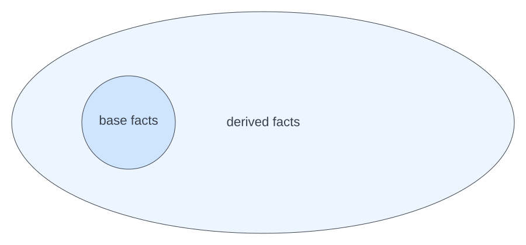
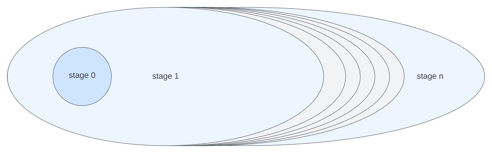

# Understanding Derivation of Facts

We discuss a language called "positive datalog". This language is
based on a logical data model and a very simple baseline model of computation:
- all data is represented as *facts*
- we start with a set of *base facts* that already exist
- we apply rules to *derive new facts*

This is repeated over and over, until no more new facts can be derived.
The application of rules can only add facts, never remove them. 

In these docs, we will call the process of applying the rules "evaluation"
and we will call the set of facts "knowledge base". The relations given
as base facts are *extensional* relations, the relations defined by rules
are the *intensional* relations.

For users, this model comes with great simplicity:
- one can organize data in any way one wants
- in doing so, one is less concerned with the way the source data is organized

Implementing such a simple model may not be simple at all, for example if
data does not fit in memory of a single machine, or if the rules are slow
to evaluate. A good implementation of a knowledge base will maintain the 
appearance of the simple model while optimizing computation underneath.

## Updates and Incremental Evaluation

Evaluation does not support updates: a single fact cannot be modified.
In order to support modifying the set of facts, we can:
- start with a new set of base facts
- do another evaluation
- replace the previous knowledge base with the result.

Once again this is a very simple way of managing knowledge base updates.
There is a special case of updating which does not require starting
from scratch: if we only add *new* base facts, and the rules do not
contain negation, we could just run evaluation again, and new derived facts
would get added on top of the ones we have. This is one way to
get "incremental evaluation".

## Stages and sequential composition 

This process of evaluation can be repeated. For example, after the first
evaluation, we may read some of the derived facts and query some external
system for more data. Or, we want to use *negation* in rule bodies to
check that some fact is *not* present.

Every stage considers the results of the previous stage as extensional
relations and applies the same evaluation process to derive the intensional
relations.

In the textbooks this is called stratified datalog. A datalog program where
negation is only applied to extensional relations is called semipositive.
Thus, a stratified datalog program is the sequential composition of semipositive
datalog programs. For this to work, there is a minor restriction that negation
cannot be part of predicate definitions that recursively depend on each
other.

